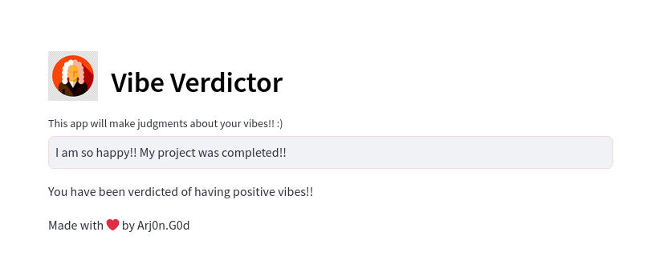
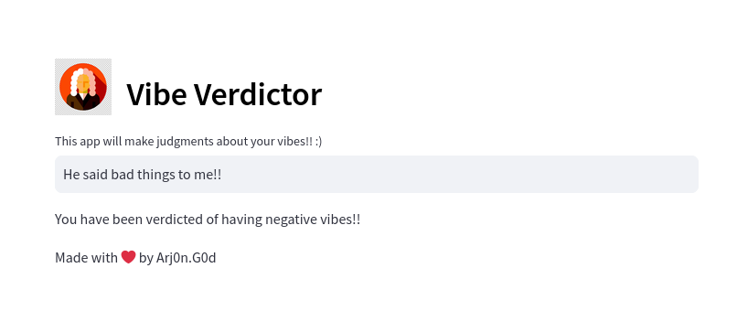

# Vibe Verdictor - Text Sentiment Analyzer

Vibe Verdictor is a text sentiment analyzer that classifies input text as having positive, negative, or neutral vibes.

## Features

1. **Sentiment Analysis:** Input some text and get your vibes checked (positive, negative, or neutral).
2. **User-Friendly Interface:** Implemented using Streamlit for easy interaction.
3. **Python:** Core programming language for the project.
4. **Jupyter Notebook:** Used for development, testing, and documentation.
5. **Pandas, NumPy:** Utilized for data manipulation and preprocessing.
6. **Scikit Learn:** Used for machine learning tasks such as model training and evaluation.

## Installation

1. Clone the repository: `git clone https://github.com/this-dot-god/vibe-verdictor.git`
2. Install dependencies: `pip install -r requirements.txt`
3. Run the app: `streamlit run app.py`

## Usage

1. Enter some text in the input box.
2. The text vibes (As predicted by the model as positive, negative, or neutral) will be displayed.

## Demo

### Home

### Home

### Positive Vibes

### Negative Vibes

